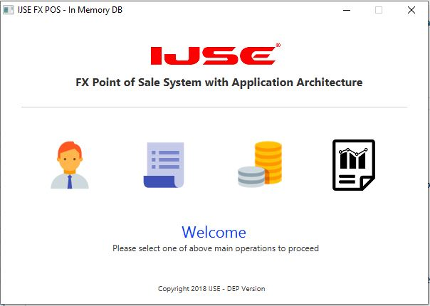
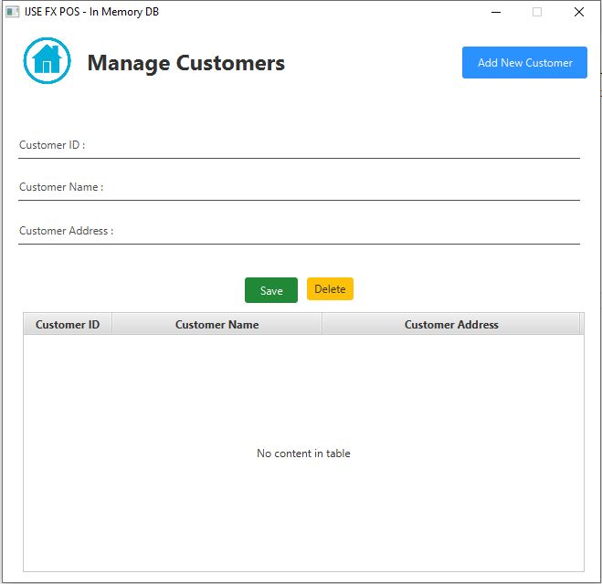
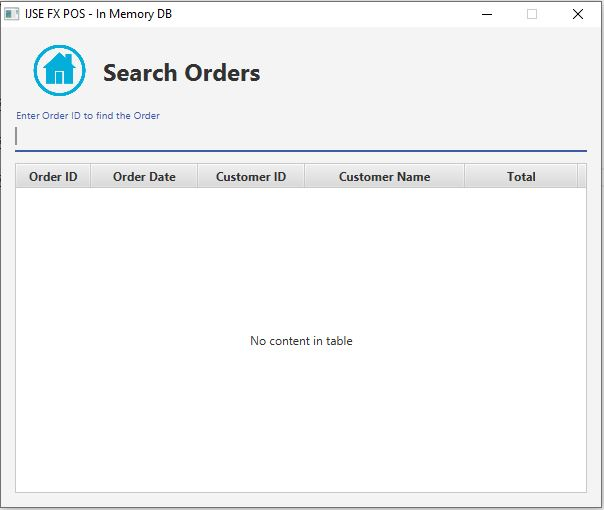

# POS SYSTEM (Using Application Architecture) -JAVAFX

In this **POS SYSTEM** has all the fucnctionalities of a pos system, like customer adding,item management,order placing and order viewing. It was develop by using the application architecture. Mainly used **MVC(model view control)** Design pattern. It Consist of four main parts;

    * Manage Customers
    * Manage Items
    * Place orders
    * View Orders
    
 

 

 
